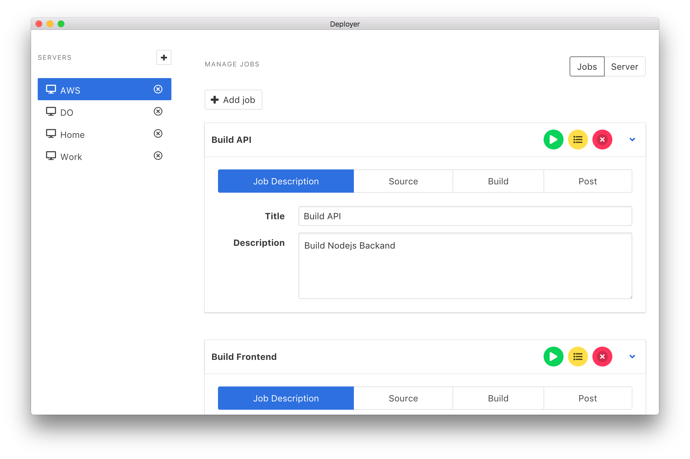

# Deployer
<p align="center">
    
</p>
<p align="center">
Simple deployment tool, that works. <br />
Deploy your apps painlessly with GUI, no more vim's and ssh clients
</p>


### Screenshot




## Description
Deployer is built with Node.js, Vue.js and Github Electron. You can add servers and create jobs per repository you want to deploy to your server. 


### Installation
Download repo and install dependencies with

```bash
yarn install
```

### Usage
You must run vue with
```bash
npm run serve
```
And also is required to run node.js server by
```bash
npm run server
```

### Packaging and Distribution
    TODO


### Contribution
Contributions are more than